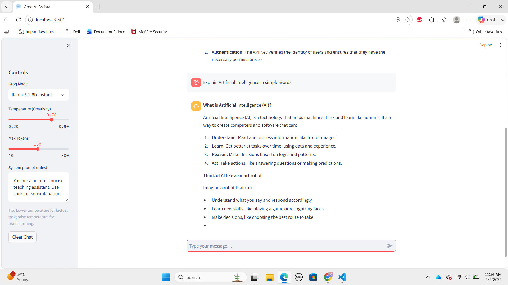

# Groq AI Chatbot with Memory 🤖

An AI-powered chatbot built using Groq, LangChain, and Streamlit. The application supports conversation memory, multiple AI models, customizable system prompts, and chat history export, providing an interactive and user-friendly chat experience.

## Features

* AI-powered chatbot using Groq LLMs
* Conversation memory for context-aware responses
* Multiple model selection
* Adjustable temperature and token settings
* Custom system prompts
* Download chat history as JSON
* Interactive Streamlit interface

## Application Preview



The chatbot allows users to interact with AI models, maintain conversation history, customize response behavior, and export chat sessions for future reference.

## Technologies Used

* Python
* Streamlit
* LangChain
* Groq API
* Python-dotenv
* JSON

## Supported Models

* Llama 3.1 8B Instant
* Qwen 3 32B
* GPT-OSS 20B

## Installation

```bash
pip install -r requirements.txt
```

## Setup

Create a `.env` file and add your Groq API key:

```env
GROQ_API_KEY=your_api_key_here
```

## Run the Application

```bash
streamlit run chatbot.py
```

## How It Works

1. Select a Groq model from the sidebar.
2. Configure temperature and token settings.
3. Enter your prompt in the chat box.
4. Receive AI-generated responses with conversation memory.
5. Download chat history in JSON format.

## Project Structure

```text
groq-ai-chatbot/
│
├── chatbot.py
├── requirements.txt
├── runtime.txt
├── chatbot_demo.png
└── README.md
```

## Author

Mahnoor Khalid

Computer Science Student | AI & Machine Learning Enthusiast | Building Real-World AI Applications

⭐ If you found this project useful, consider giving it a star.
